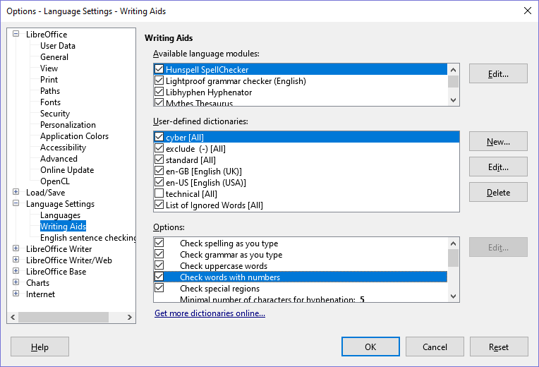

# LibreOffice Writer

## Dictionary Install

1. Download [cyber.dic](./cyber.dic) and [exclude.dic](./exclude.dic) from the LibreOffice folder on GitHub. Put them in a permanent location on your computer, within the same folder where LibreOffice saves other dictionaries.

    **Note:** The automatic “internal” user-defined dictionary in LibreOffice is called `standard.dic`.  
    For a Linux system, it's found in a folder similar to `/home/[name]/.config/libreoffice/4/user/wordbook`.  
    For a Windows system, it’s found in `C:\\Users\[name]\AppData\Roaming\LibreOffice\4\user\wordbook`.  
    This is where you should save cyber.dic.

2. Open a file in LibreOffice Writer. Select **Tools** > **Options**. This will open a dialog box. On the left column in the dialog, expand **Language Settings** and select **Writing Aids**.

    

3. Under “User-defined dictionaries,” make sure that `cyber` and `exclude` are both checked. Also make sure the top four entries under “Options” are checked.
