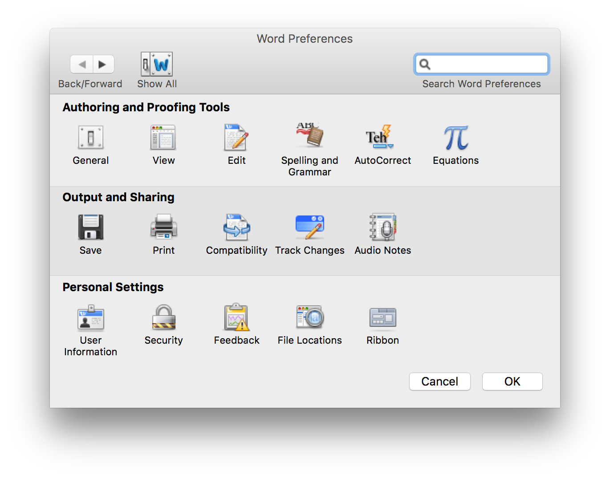
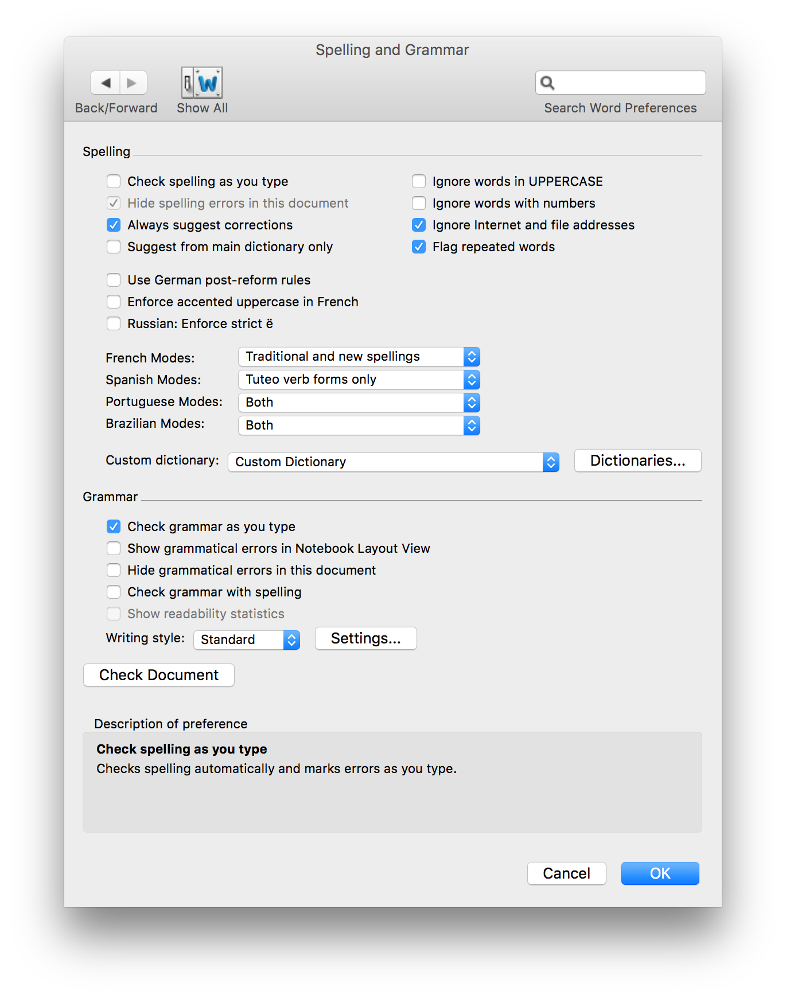
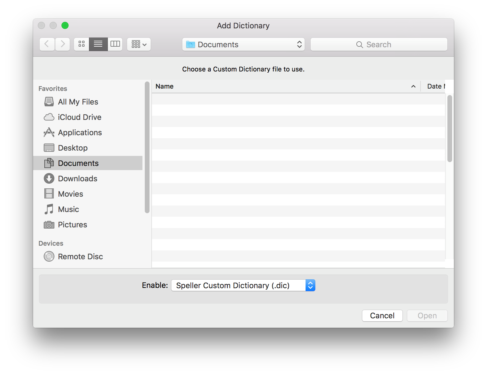

# Microsoft Word (macOS)

## Dictionary Install 

1. Download [cyber.dic](./cyber.dic) and save it in a permanent location. (Access the [cyber.dic](./cyber.dic) file on GitHub, select **Raw**, and press **Cmd**+**S** to download it directly to your computer.)

2. Open a Word document. In the Word menu, select **Preferences** > **Spelling & Grammar**. Uncheck the following:

    - Ignore words in UPPERCASE
    - Ignore words with numbers
    - Suggest from main dictionary only

    
    

3. In the same menu, select the **Dictionaries…** button.

4. Click the **Add** button and select the cyber.dic from its proper location.

    

-----------------------------------------------------
### Official Support

“Add words to your spell check dictionary in for Mac”  
<https://support.office.com/en-us/article/add-words-to-your-spell-check-dictionary-in-for-mac-b8d6797b-860a-4021-a87d-20ee7aba40f8>

“Use a custom dictionary in Office for Mac”  
<https://support.office.com/en-us/article/use-a-custom-dictionary-in-office-for-mac-22ce4a39-c63b-41a3-903c-a6881c891ba7>
