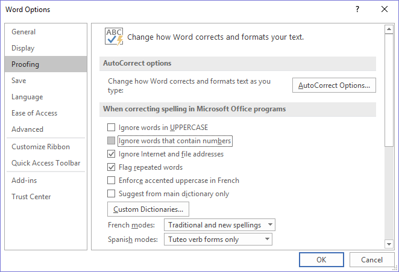
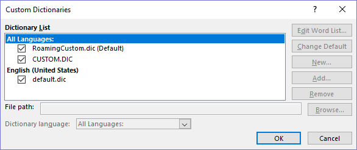

# Microsoft Word (Windows)

## Dictionary Install

1. Download [cyber.dic](./cyber.dic) from GitHub and save it in a permanent location.  
    By default, Microsoft custom dictionaries are stored at the path: `C:\Users\[user]\AppData\Roaming\Microsoft\UProof`

2. In Word, go to **File** > **Options** > **Proofing** > **When correcting spelling** and uncheck:
    - Ignore words in UPPERCASE
    - Ignore words that contain numbers

    

3. In the same menu, click on **Custom Dictionaries…**

    

4. Click on any one of the files listed in the Dictionary List, which will ungrey the **New** button. Then click on **Add**, and select cyber.dic from its proper location.

## Exclusion File Install: [exclude.txt](./exclude.txt)

1. Find the location where Word dictionary files are stored. In Windows 10, it is `C:\Users\[user]\AppData\Roaming\Microsoft\UProof`.  

2. Find the correct exclusion file for the version of English you use. For example, in Word 2016, U.S. English has the code 0409, and the file is named `ExcludeDictionaryEN0409.lex`.

    **Note:** These files are automatically pulled, so you cannot change the name or move them.

3. Once you have identified the existing file, open it in a plaintext editor. Copy/paste our exclusion word list into the file and save it.

4. Restart Word.

-----------------------------------------------------
### Useful Resources

How to “remove” a word from Word's main spelling dictionary  
<http://wordfaqs.ssbarnhill.com/ExcludeWordFromDic.htm>

Catch Costly Mistakes with an Exclusion Dictionary  
<https://www.timeatlas.com/word-exclusion-dictionary/>

Official Support: How to add a custom dictionary in Word  
<https://support.microsoft.com/en-us/help/322198/how-to-add-a-custom-dictionary-in-word>
